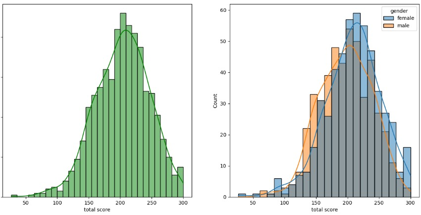
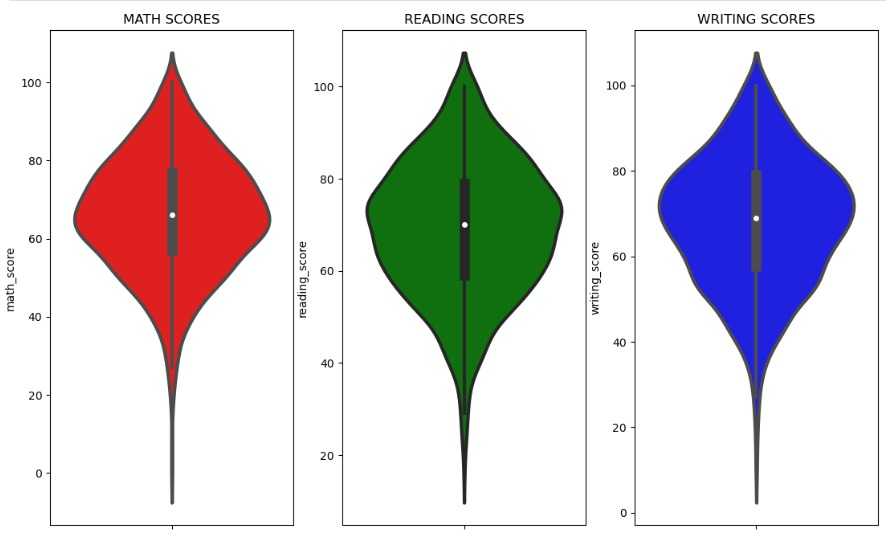
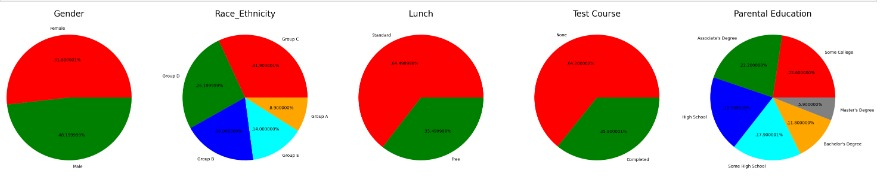
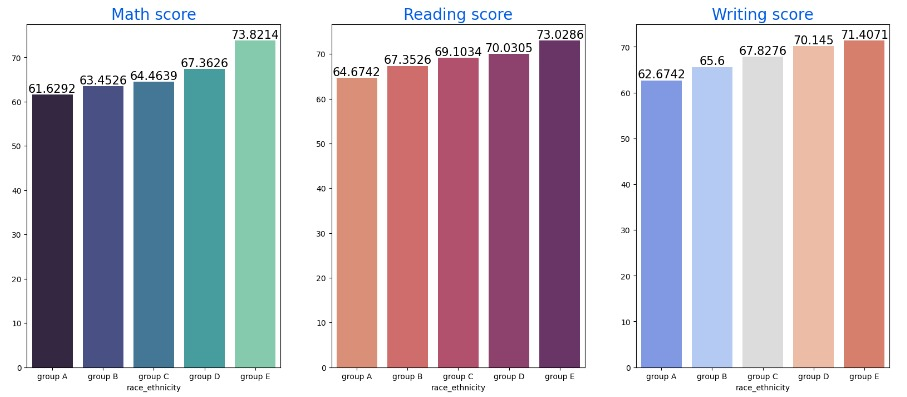
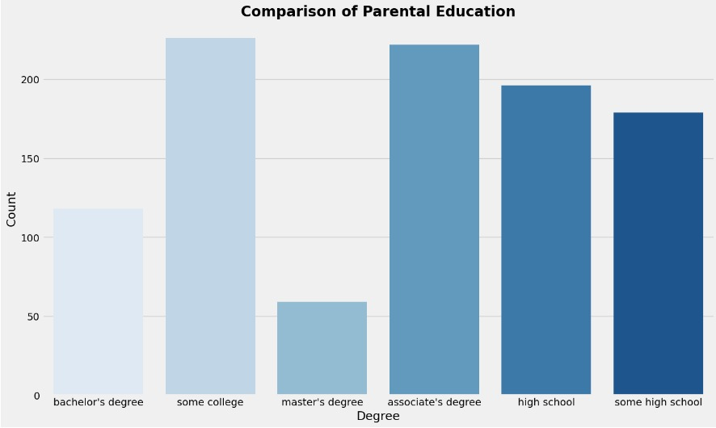
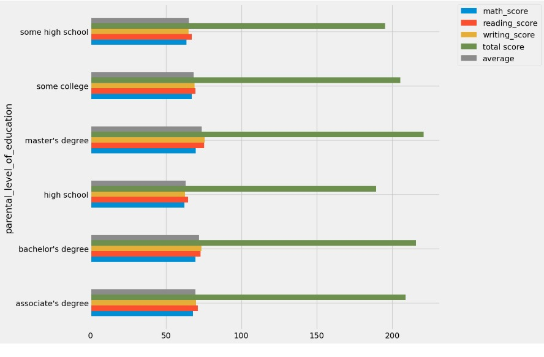
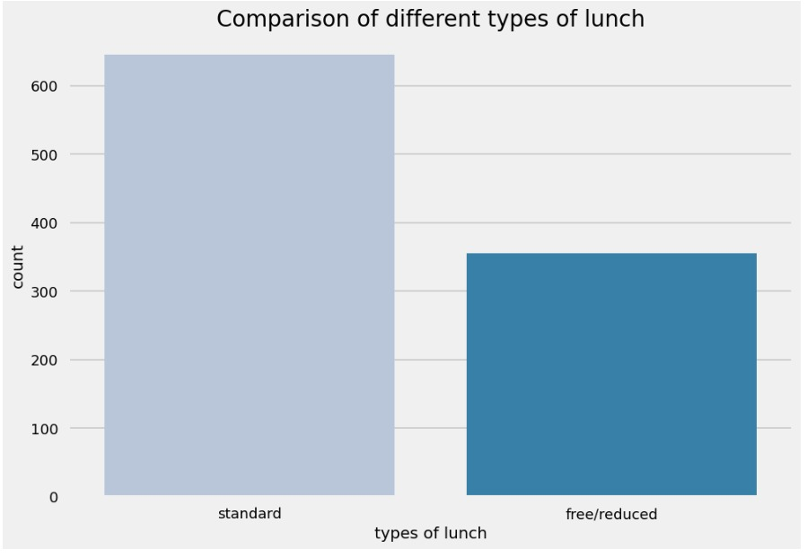

# Student_Performance_Analysis
# Student Performance Analysis and Prediction

## Table of Contents
- [Project Overview](#project-overview)
- [Dataset Description](#dataset-description)
- [Problem Statement](#problem-statement)
- [Objectives](#objectives)
- [Methodology](#methodology)
- [Exploratory Data Analysis (EDA)](#exploratory-data-analysis-eda)
- [Feature Engineering and Selection](#feature-engineering-and-selection)
- [Modeling](#modeling)
- [Evaluation Metrics](#evaluation-metrics)
- [Results and Insights](#results-and-insights)
- [Project Structure](#project-structure)
- [Technologies Used](#technologies-used)
- [Deployment](#deployment)
- [Future Enhancements](#future-enhancements)
- [Conclusion](#conclusion)

## Project Overview
This project aims to analyze student performance data and develop a machine learning model to predict student math scores. By identifying key factors influencing performance, the project provides actionable insights for educators to implement targeted interventions. Utilizing data analysis, visualization, and a variety of machine learning models, we aim to build a reliable and interpretable prediction model ready for deployment.

## Dataset Description
The dataset encompasses a range of features, including demographic, family, and school-related attributes, such as:

- **Demographic Information**: Age, gender, and socioeconomic background.
- **Family Attributes**: Parental education levels, family size, and home environment.
- **Academic and Behavioral Factors**: Study time, past grades, attendance, and participation in extracurricular activities.
- **School-Related Factors**: School type, resources, and commute time.

These variables help in constructing a comprehensive profile of each student and understanding the multiple dimensions influencing their academic performance.

## Problem Statement
Student performance is influenced by a variety of factors, making it challenging to identify those most critical for success. This project aims to build a model to predict math scores, helping educators identify students at risk and offer timely support.

## Objectives
- **Identify Key Predictors**: Determine which factors have the greatest influence on math scores.
- **Build a Predictive Model**: Develop a machine learning model with high predictive accuracy.
- **Provide Insights**: Generate actionable insights that could guide educational interventions.
- **Create a Deployment-Ready Solution**: Organize the project for easy deployment in real educational settings.

## Methodology
The project methodology includes the following steps:

1. **Data Cleaning and Preprocessing**:
   - Handle missing values and outliers.
   - Convert categorical variables into numeric form using encoding techniques.
   - Scale features to improve model performance and training efficiency.
  
2. **Exploratory Data Analysis (EDA)**:
   - Use statistical analysis and visualizations to explore data distributions and correlations.
   - Examine trends and potential anomalies to guide feature selection.

3. **Feature Engineering and Selection**:
   - Engineer new features if necessary to capture complex relationships.
   - Select relevant features based on statistical and model-based metrics.

## Exploratory Data Analysis (EDA)
During the EDA phase, various visualizations helped uncover trends and correlations, providing valuable insights into relationships within the data:

### 1. Total Score Distribution by Gender

A histogram comparing total score distributions across genders. The left plot shows the general distribution, with most scores concentrated around the mean, while the right plot contrasts male and female distributions. This reveals any performance discrepancies that may exist between genders, though both distributions largely follow similar shapes.

### 2. Violin Plots of Math, Reading, and Writing Scores

Violin plots illustrating score distributions in math, reading, and writing. Math scores appear lower than reading and writing scores, indicating that students may struggle more with math. The shape and spread of each violin plot provide insights into median scores, score variance, and potential performance clusters within each subject.

### 3. Demographic Distribution

This set of bar charts visualizes key demographic factors such as gender, race/ethnicity, lunch type, test preparation course completion, and parental education levels. These factors help identify diverse backgrounds and potentially underserved groups, offering insights into how demographic variables may contribute to performance gaps.

 **Parental Education Level and Count**
A chart showing the number of students with each level of parental education. This visualization indicates a correlation between parental education and student performance. Most students have parents with some college education or an associate degree, and higher parental education often aligns with higher student scores.

 **Average Scores by Parental Education Levels**
A horizontal bar chart displaying average scores in math, reading, and writing, grouped by parental education level. The chart shows that students with parents holding higher degrees tend to achieve better scores, highlighting the influence of parental education on academic outcomes.

 **Comparison of Lunch Types**
A bar chart showing the number of students by lunch type (standard vs. free/reduced). This visualization helps illustrate socioeconomic disparities, as students on reduced lunch programs may face additional challenges affecting their performance.

### 4. Math, Reading, and Writing Scores by Race/Ethnicity
   
   - **Description:** This image displays bar charts comparing the average scores for math, reading, and writing across different race/ethnicity groups (group A to group E). Each bar represents the average score in a specific subject for students within each group. Notably, Group E has the highest average scores across all subjects, suggesting a potential correlation between ethnicity and academic performance. This visualization helps identify performance disparities among demographic groups.

### 5. Comparison of Parental Education Levels
   
   - **Description:** This bar chart illustrates the distribution of parental education levels among students, categorizing them by degree attainment (e.g., some college, associate's degree, high school). The chart highlights that the majority of parents have attended some college or have an associate's degree. This distribution helps contextualize how parental educational attainment varies among students and could potentially impact student performance, as indicated by other findings in the project.

### 6. Average Scores by Parental Education Levels
   
   - **Description:** This grouped bar chart shows the average scores in math, reading, and writing based on parental education levels. Each education level (e.g., bachelor's degree, high school) is associated with the student's scores in each subject. The visualization indicates that students whose parents have higher education levels tend to achieve better scores, especially in math and reading, reinforcing the importance of parental influence on academic outcomes.

### 7. Comparison of Lunch Types
   
   - **Description:** This bar chart displays the distribution of students based on lunch type, distinguishing between standard and free/reduced lunch programs. The count of students in each category suggests socioeconomic differences within the dataset, as students on free/reduced lunch programs may face additional challenges impacting their performance. The visualization highlights potential socioeconomic factors that could influence academic outcomes.

## Feature Engineering and Selection
Based on the insights from EDA, several key features were selected or engineered to improve model accuracy. New features such as parental education level were included, and existing features were transformed to capture complex relationships within the data.

## Modeling
To create a robust predictive model, several machine learning algorithms were evaluated. Each model was chosen based on its ability to capture specific data patterns, its interpretability, and suitability for the dataset.

1. **Linear Regression**
   - **Description**: Serves as a baseline model, assuming a linear relationship between predictors and math scores.
   - **Strengths**: Simple and interpretable, making it easy to understand the influence of each feature on the target.
   - **Limitations**: Limited in capturing non-linear relationships in data.
   
2. **Ridge and Lasso Regression**
   - **Ridge Regression**: Adds L2 regularization to reduce overfitting by penalizing large coefficients.
   - **Lasso Regression**: Employs L1 regularization, which can shrink some coefficients to zero, effectively performing feature selection.

3. **Decision Tree Regressor**
   - **Description**: A non-linear model that splits the dataset into branches, making decisions at each node based on feature values.

4. **Random Forest Regressor**
   - **Description**: An ensemble model that combines multiple decision trees, averaging their outputs for improved performance.
   
...(and so on for each model)

## Evaluation Metrics
Each model was evaluated using the following metrics:
- **Mean Absolute Error (MAE)**: Measures the average magnitude of errors between predicted and actual values.
- **Mean Squared Error (MSE)**: The average of squared errors, emphasizing larger errors.
- **R-Squared (R²)**: The proportion of variance explained by the model, indicating overall model fit.

## Results and Insights
After evaluation, Linear Regression emerged as the best-performing model, achieving an impressive accuracy of 98.5%. Key insights include:
- **Significant Predictors**: Parental education level and study time were consistently significant predictors of math scores.
- **Actionable Findings**: The results suggest that increasing parental support and study time can positively impact student performance.

## Project Structure

- **`data/`**: Contains raw and processed datasets.
- **`notebooks/`**: Jupyter notebooks for analysis and modeling.
- **`scripts/`**: Modular scripts for data cleaning, feature engineering, and model training.
- **`models/`**: Pre-trained models ready for deployment.
- **`results/`**: Visualizations and analysis reports.

## Technologies Used

- **Python**: Main programming language.
- **Libraries**:
   - **Pandas** and **NumPy** for data manipulation.
   - **Matplotlib** and **Seaborn** for visualization.
   - **scikit-learn** for modeling.
   - **Flask** or **Django** (optional) for web deployment.

## Deployment

The project is organized for deployment using frameworks like Flask or Django, allowing it to be used as a real-time prediction tool in educational settings.

## Future Enhancements

- **Real-Time Data Integration**: Use an API for real-time updates.
- **Advanced Models**: Expand to deep learning models if dataset grows.
- **Interactive Dashboard**: Build a dashboard for educators to track predictions and insights.

## Conclusion

This project demonstrates the use of data science and machine learning to analyze and predict student performance. By identifying key factors, the project provides insights that can support academic improvement through targeted interventions.

---